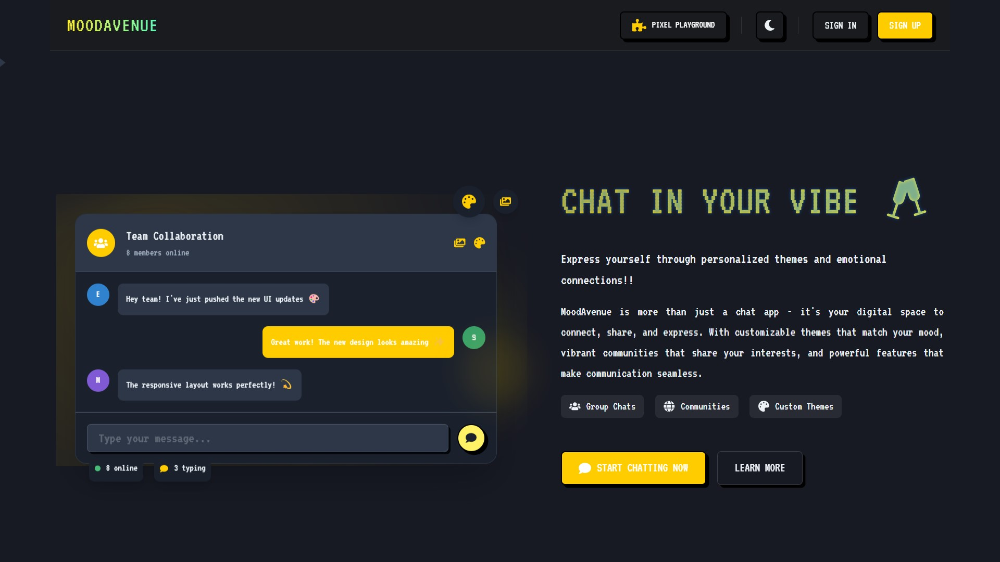

<div align="center>
✨ MoodAvenue - Next-Gen Social Experience ✨
</div>

<div align="center">
  
  
  
  ### 🌈 Express Yourself. Connect Authentically. Explore Boundlessly. 🌈
  
  [](https://reactjs.org/)
  [](https://chakra-ui.com/)
  [](https://vitejs.dev/)
  
  <p align="center">
    <strong>🏆 Proudly developed for the Outlier Frontend UI Development Hackathon - April 2025 🏆</strong>
  </p>

</div>

## 🚀 Overview

MoodAvenue is a revolutionary social platform designed to provide users with an immersive and engaging social experience. Built with modern technologies and a focus on user experience, MoodAvenue goes beyond traditional social media to create meaningful connections and authentic content discovery.

---

## ✨ Key Features

### 🔐 Seamless Authentication
- **Smart Sign-up/Sign-in** - Frictionless onboarding with intuitive flows
- **Secure User Management** - Robust authentication and data protection
- **Custom Profiles** - Express your unique identity

### 📱 Dynamic Home Feed
- **Multi-format Content** - Enjoy diverse media types in one unified stream
- **Smart Algorithms** - Content tailored to your preferences and mood
- **Engagement Tools** - Interactive ways to respond to content you love
- **Mood Filters** - Discover content based on your current emotional state

### 🔍 Immersive Explore Experience
- **Visual Discovery Grid** - Instagram-style content exploration
- **Rich Media Support** - Browse through:
  - 📸 Stunning photography
  - 🎬 Engaging videos
  - 🖼️ Curated galleries
  - 🎵 Audio experiences with visualizers
  - 📝 Thoughtful text posts with artistic backgrounds
- **Trending Now** - Stay updated with what's capturing attention
- **Category Navigation** - Find exactly what resonates with you

### 💬 Advanced Messaging
- **Real-time Conversations** - Connect instantly with friends
- **Rich Media Sharing** - Express yourself beyond text
- **Group Dynamics** - Create communities within conversations
- **Smart Notifications** - Never miss important messages
- **Presence Awareness** - See who's available to chat

### 🔔 Intelligent Notifications
- **Activity Pulse** - Stay in the loop with real-time updates
- **Engagement Alerts** - Know when people interact with your content
- **Custom Preferences** - Control your notification experience
- **Digest Options** - Get summaries on your schedule

### 👤 Expressive Profiles
- **Visual Identity** - Showcase your personality with customizable elements
- **Content Showcase** - Highlight your best contributions
- **Network Building** - Grow meaningful connections
- **Insights Dashboard** - Track your social impact

### 👥 Vibrant Communities
- **Interest Hubs** - Find your tribe based on passions
- **Public & Private Spaces** - Choose your level of openness
- **Community Tools** - Built-in features for healthy group dynamics
- **Themed Content** - Explore topics that matter to you

### 🔖 Smart Content Saving
- **Intelligent Bookmarking** - Save content for later with context
- **Collections** - Organize saved items your way
- **Quick Access** - Find what you saved when you need it
- **Mood-based Recommendations** - Rediscover saved content when it matches your mood

### 🎨 Personalized Experience
- **Adaptive Themes** - Light, dark, and custom color schemes
- **Accessibility First** - Designed for everyone
- **Cross-device Harmony** - Consistent experience everywhere

### 🌟 Premium Features
- **Analytics Dashboard** - Understand your social patterns
- **Enhanced Search** - Find exactly what you're looking for
- **Content Creation Studio** - Express yourself with powerful tools

---

## 💻 Technical Excellence

MoodAvenue is built on a foundation of modern web technologies:

- **⚛️ React** - For a dynamic and responsive UI
- **🎨 Chakra UI** - Beautiful, accessible component system
- **🧭 React Router** - Seamless navigation experience
- **🔍 React Icons** - Expressive visual elements
- **⚡ Vite** - Lightning-fast development environment
- **📱 Responsive Design** - Perfect on every device

---

## 🏁 Getting Started

Experience MoodAvenue on your local machine:

```bash
# Clone the MoodAvenue experience
git clone [repository-url]

# Enter the project universe
cd MoodAvenue

# Install the magic
npm install

# Launch your social journey
npm run dev
```

Visit `http://localhost:5173` to begin your MoodAvenue experience!

---

## 🧠 Development Philosophy

MoodAvenue is crafted with care following these principles:

- **🧩 Component Architecture** - Modular, reusable building blocks
- **♿ Accessibility** - Social media for everyone
- **📊 Performance** - Lightning-fast experiences
- **🔄 Continuous Improvement** - Evolving with user needs
- **🛡️ Security** - Protection at every layer

---

## 🔮 Future Horizons

The MoodAvenue journey continues with planned enhancements:

- **🤖 AI-Powered Recommendations** - Content that truly understands you
- **🌐 Global Communities** - Connect across languages and cultures
- **📊 Advanced Analytics** - Deeper insights into your social world
- **📲 Native Mobile Apps** - Take MoodAvenue everywhere
- **🧠 Mood Analysis** - Match content to your emotional state

---

<div align="center">
  
  ### 💖 Join the MoodAvenue revolution and redefine your social experience! 💖
  
  [Website: Live Demo](https://mood-avenue.vercel.app/) 
  
  <p>
    <em>Created with ❤️ for the Outlier Frontend UI Development Hackathon (April 2025)</em>
  </p>
  
</div>
